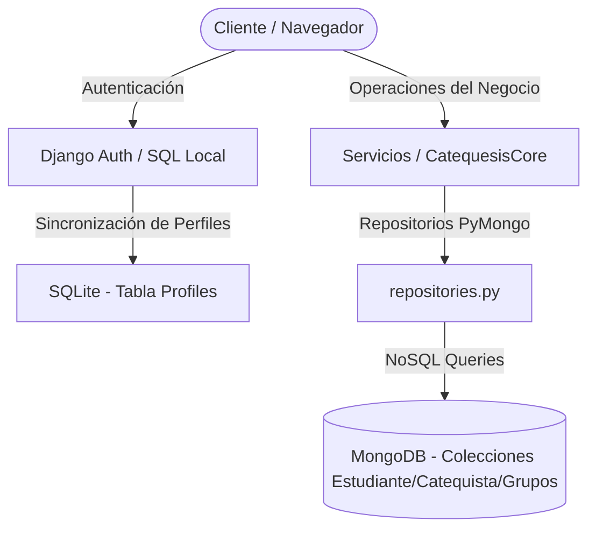

# ⛪ Catequesis_SS


Plataforma integral diseñada para la automatización, control y gestión de estudiantes, catequistas y sacramentos en grupos parroquiales. Implementa una **arquitectura híbrida de base de datos** para mayor flexibilidad y velocidad en el procesamiento de documentos complejos.

---

## 📐 Arquitectura de Persistencia Híbrida

El sistema desacopla los datos de autenticación del usuario de las entidades operacionales del negocio:



---

## ✨ Características Principales
*   **Estructura de Base de Datos Híbrida:** 
    *   **SQL (SQLite/PostgreSQL):** Utilizada exclusivamente para el sistema de autenticación nativo de Django, sesiones y el modelo `Profile`.
    *   **NoSQL (MongoDB):** Utilizada para almacenar colecciones con estructuras dinámicas y complejas como Estudiantes (con padres y sacramentos embebidos), Catequistas y Grupos.
*   **SSO Silencioso integrado (Single Sign-On):** A través del `SilentSSOMiddleware`, se comunica de manera transparente con el servidor de Keycloak para iniciar sesión automáticamente si el usuario ya inició sesión en otra aplicación autorizada.
*   **Decoradores de Seguridad por Rol:** Control de acceso estricto mediante `@admin_required` y `@catequista_required`.

---

## 🛠️ Requisitos Previos
*   Python 3.11 o superior.
*   Una instancia de MongoDB (local o Atlas en la nube).
*   Instancia activa de Keycloak.

---

## ⚙️ Configuración del Entorno Local

1.  **Clonar el proyecto y acceder a la carpeta:**
    ```bash
    cd Catequesis_SS/CatequesisDjango
    ```

2.  **Entorno Virtual y Dependencias:**
    ```powershell
    python -m venv .venv
    .\.venv\Scripts\Activate.ps1
    pip install -r requirements.txt
    ```

3.  **Variables de Entorno (.env):**
    Crea un archivo `.env` en la raíz de la carpeta `CatequesisDjango/`:
    ```env
    SECRET_KEY=tu_secreto_django
    DJANGO_SETTINGS_MODULE=CatequesisDjango.settings.development
    
    # MongoDB Config
    MONGO_URI=mongodb://localhost:27017/Catequesis
    
    # Keycloak Config
    KEYCLOAK_URL=http://localhost:8080
    KC_REALM=catequesis-realm
    KC_CLIENT_ID=catequesis-app
    KC_CLIENT_SECRET=tu-client-secret-de-keycloak
    ```

4.  **Migrar base de datos SQL y Arrancar Servidor:**
    ```bash
    python manage.py migrate
    python manage.py runserver 8001
    ```
    *Nota: Se recomienda correrlo en un puerto diferente (ej. 8001) para probar el SSO en paralelo con Textil-APP (puerto 8000).*

---

## 🔐 Configuración de Clientes en Keycloak
Para habilitar el flujo de Single Sign-On entre este proyecto y Textil-APP:
1.  Asegura que ambos clientes pertenezcan al mismo Realm o compartan la cookie de sesión del navegador.
2.  Registrar el cliente `catequesis-app` como **Confidential**.
    *   **Valid Redirect URIs:** `http://127.0.0.1:8001/callback/`
    *   **Post Logout Redirect URIs:** `http://127.0.0.1:8001/`
3.  Definir los roles de cliente en Keycloak: `admin` y `catequista`.
